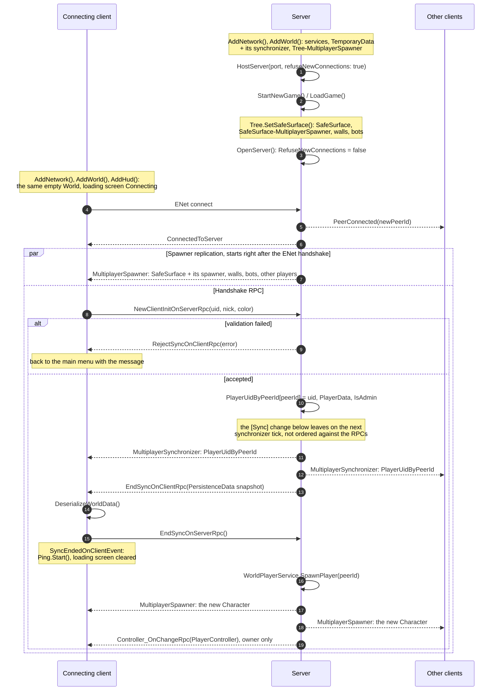

# Networking

[← Project README](../README.md)

The **stock Godot high-level multiplayer** is used (`SceneMultiplayer` + `ENetMultiplayerPeer`).

## Main nodes

* **`Network`** ([Scenes/Game/Network/Network.cs](../Scenes/Game/Network/Network.cs)) — a wrapper over
  `MultiplayerApi`, responsible for `ConnectToServer()`, `HostServer()`, `OpenServer()` and a correct
  `Shutdown()`. It creates a new `SceneMultiplayer` bound to the `Game` node, so that on returning to
  the menu all the old subscriptions are guaranteed to fall away.
* **`NetworkStateMachine`** — the states `NotInitialized → Connecting/Hosting → Connected/Hosted →
  Disconnected` and the derived flags (`IsClient`, `IsServer`, `IsActiveGameState`).

## Process roles: `IsServer()` / `IsClient()`

| Mode | `Net.IsServer()` | `Net.IsClient()` |
|---|---|---|
| Main menu | `true` | `true` |
| Single-player game | `true` | `true` |
| Hosting "from inside the client" | `true` | `true` |
| Connecting to someone else's server | `false` | `true` |
| Dedicated server (`--server`) | `true` | `false` |

The [Startup flow](Startup-flow.md) describes how each mode is created.

## RPC

The main means of exchange. A "public wrapper + private `*Rpc`" pair:

```csharp
public void Save(string saveFileName) => RpcId(ServerId, MethodName.SaveRpc, saveFileName);
[Rpc(MultiplayerApi.RpcMode.AnyPeer, CallLocal = true)]
private void SaveRpc(string saveFileName) { /* ... */ }
```

No blank line between the two, since the public method is just a convenient alias for the private one.
The mode is always stated explicitly. The full cheat sheet is in the
[Code style conventions](Code-style.md).

## Spawning objects

`WorldMultiplayerSpawnerService.AddSpawnerToNode(node)` attaches a `WorldMultiplayerSpawner` (a
descendant of `AbstractMultiplayerSpawner` from KludgeBox) to a node. The spawner watches that node and
synchronizes over the network every sub-node created on it; it is named after the
`<node name>-MultiplayerSpawner` pattern and is deleted automatically together with the observed node.
The exception is the spawner for `Tree`, which sits right in `World.tscn` rather than being created from
code. Only the scenes listed in `SyncedPackedScenes` can be spawned. A spawner also hands the nodes it
already tracks to a peer that connects later — see [Client connection](#client-connection).

## Field synchronization

The `[Sync]` attribute from `KludgeBox.Godot.Nodes.MpSync` (example:
`WorldTemporaryData.PlayerUidByPeerId`). What to sync via `[Sync]` and what to put into the save
snapshot is covered in [Data and saves](Data-and-saves.md).

## Transfer channels

`Consts.TransferChannel` is written as `[Rpc(TransferChannel = (int) Consts.TransferChannel.X)]` so
that independent streams do not wait for each other when a message is lost. The rows are in
declaration order — the position of a channel is its number.

| Channel | What goes through it |
|---|---|
| `Default` | Godot's channel 0: every RPC without an explicit channel, `SceneMultiplayer` replication included. Declared first so that none of our channels lands on it |
| `Chat` | Chat messages and the commands sent as chat — `WorldChatService` |
| `StatsHp` | Damage and heal events — `CharacterSynchronizer_Stats` |
| `StatsCache` | Stat modifier updates for the client-side stat cache — `CharacterSynchronizer_Stats` |

## Payload

Godot primitives or `byte[]` from MessagePack; JSON does not travel over the network. The maximum sync
packet size is `Network.MaxSyncPacketSize` = `1350 * 32` (about 43 KB: 32 ENet packets of one MTU
each). It limits `SceneMultiplayer` replication only — the size of an RPC is not capped, so the
initial world snapshot, which goes to the client in a single call, is not affected by it.

## Client connection

The handshake lives in `WorldSynchronizerService` and runs identically for a networked and a
single-player game — in single player there is no `Network` node at all, and `RpcId(ServerId, …)` plus
`CallLocal = true` make every step execute in place.

### Before the connection

The `World` and all of its sub-entities are built by the game starter, before the peers meet:

* **Server** ([HostMultiplayerGameStarter](../Scenes/Game/Starters/HostMultiplayerGameStarter.cs)) —
  `AddNetwork()`, `AddWorld()`, then `HostServer(port, refuseNewConnections: true)`: the port is open
  but closed for business. Only afterwards comes `ServerStartWorld()` → `StartNewGame()` / `LoadGame()`
  → `Tree.SetSafeSurface()`, which creates the `SafeSurface`, hangs a `SafeSurface-MultiplayerSpawner`
  on it and fills it with walls and bots. The last step is `OpenServer()`, so a client can only get in
  once the world is fully assembled.
* **Client** ([ConnectToMultiplayerGameStarter](../Scenes/Game/Starters/ConnectToMultiplayerGameStarter.cs))
  — `AddNetwork()`, `AddWorld()`, `AddHud()` and only then `ConnectToServer()`. The `World` is the same
  scene with the same services, but empty: `WorldTree._Ready()` only makes a placeholder `Surface`
  outside the tree so that other services do not get a `null`, and the real one arrives from the server.

On both sides `World._EnterTree()` registers the services, `WorldTemporaryData._Ready()` → `Di.Process`
attaches an `AttributeMultiplayerSynchronizer` built from the `[Sync]` fields, and the
`Tree-MultiplayerSpawner` comes from `World.tscn` itself.

### The handshake



### What runs beside the handshake

Two of the streams on the diagram are not driven by our RPCs, which is why the order between them and
`EndSyncOnClientRpc` is not guaranteed:

* **`MultiplayerSpawner`.** As soon as the peer is registered, every spawner sends the new client the
  nodes it already tracks — the `SafeSurface` (together with its own spawner, since the spawner scene
  is spawnable itself), the walls, the bots and the characters of the players already in the game. The
  character of the connecting player is created later, in `SpawnPlayer(peerId)`, and reaches everyone
  the same way. The personal `PlayerController` goes to the owner alone — `SetControllerToClient` is an
  `RpcId`, for the rest the character stays on a `RemoteController`.
* **`[Sync]` `WorldTemporaryData`.** The synchronizer exists on both sides from the moment the `World`
  is created; the value travels when the server changes `PlayerUidByPeerId` inside
  `NewClientInitOnServerRpc`, on the next tick of the synchronizer and to every client at once.
