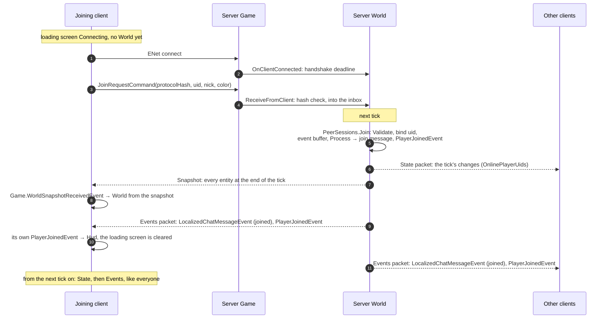

# Networking

[← Project README](../README.md)

ENet carries raw bytes; there is no RPC, no `MultiplayerSpawner` and no `MultiplayerSynchronizer`. The server runs
the game, a client only applies what the server sends and sends commands back. The services named here live in the
World; their layers and the World itself are in [World](World.md).

## Transport and roles

* **`Network`** ([Scenes/Game/Network.cs](../Src/NeonWarfare/Scenes/Game/Network.cs)) — ENet
  only: `HostServer()`, `OpenServer()`, `ConnectToServer()`, `Send(peerId, bytes)`, `Disconnect(peerId)` and the
  connection events. It creates a fresh `SceneMultiplayer` per `Game`, so no handler outlives the session, and
  unsets it on `Game.TreeExiting`. A server is hosted with `RefuseNewConnections` and opened only after its World
  is built.
* **`Game`** ([Scenes/Game/Game.cs](../Src/NeonWarfare/Scenes/Game/Game.cs)) — the transport of the World: it
  implements `IClientsConnection` (server → clients) and `IServerConnection` (client → server) and routes the
  packets and connection events of `Network` into `World.ReceiveFromClient` / `ReceiveFromServer` /
  `OnClientConnected` / `OnClientDisconnected`. `Game` also owns what the client needs before its World exists:
  `EntityCatalog`, `NetMessageCodec` (with the protocol hash) and the RepliCAT `Replicator`.
* **The host is an ordinary peer.** Its own peer is peer 1 (the server's id): a packet for it never reaches ENet,
  `Game` hands it to its own World synchronously, inside the call. So the host's commands pass the same decoding and
  whitelist as a remote client's, and its event handlers run in the physics step, before `_Process`. Single player
  is a host without `Network`.

A process has no role. What runs is decided by the set of layers the starter builds the World from
(see [World](World.md#layers)): no code asks "am I the server".

## The server tick

`ServerTickNode` (`ProcessPhysicsPriority = int.MaxValue`, added only with the Simulation) calls
`ServerTickLoop.RunTick()` last in every physics step, so the physics callbacks and every other `_PhysicsProcess`
belong to the tick. `RunTick` goes strictly in this order:

1. `CurrentTick++`;
2. `CommandDispatcher.ProcessAll()` — every command and disconnection received since the last tick;
3. `PeerGatekeeper.DisconnectExpired()` — peers that have not joined in `HandshakeTimeout` (10 s);
4. the state packet to every peer joined before this tick;
5. the snapshots to the peers joined in this tick;
6. the saves requested in this tick (`SaveWriter.WriteRequested`, see [Data and saves](Data-and-saves.md));
7. the events packet of each joined peer.

The Simulation changes the models only inside the tick: it has no deferred calls, timers or `async`
(`SimulationTimingTests`).

## Commands: client → server

A command is a `Command` record with MessagePack keys. The HUD sends it through `World.Send<T>` →
`PlayerCommandSender`, the only sender in the World; `JoinRequestCommand` alone is sent by `Game`
(`SendJoinRequest`), before a remote client has a World. A command is sent at once, not at the tick.

On the server `CommandInbox` decodes a packet on arrival, against the whitelist `CommandHandlerRegistry` builds from
the found handlers: a type without a network handler, a broken body or trailing bytes is logged as `WARN` and
dropped. A `JoinRequestCommand` with another protocol hash is rejected right here (`JoinRejected` + disconnect).
The rest waits in the inbox together with the `PeerDisconnected` entries, one order per peer.

`CommandDispatcher` drains the inbox in the tick: a join goes to `PeerSessions`, a disconnection too, and any other
command — only from a joined peer — to its `IPlayerCommandHandler<T>`, which gets the sender's uid, never the peer:
`Validate`, then `Process`. A throwing entry is logged and costs only itself.

## Packets: server → client

The first byte of every packet is its `ServerPacketKind`:

| Kind | Content | To whom |
|---|---|---|
| `Snapshot` | The tick, then a spawn record of every entity (`StateReplicator.WriteSnapshot`) | A peer that joined in this tick, except the host's own |
| `State` | The tick, then spawns → models → despawns (`StateReplicator.TryWrite`) | Every peer joined before this tick, except the host's own |
| `Events` | The events of this tick for this peer (`EventOutbox.DrainEvents`) | Every joined peer, the host's own included |
| `JoinRejected` | One `JoinRejectReason` byte (`JoinRejectedPacket`), frozen across builds | A peer whose join is refused, just before the disconnect |

The state packet is the same for everyone and written once; an empty one is not sent. It goes before the events,
so an event handler sees the models already at the end of the tick, on the host and on a remote client alike.
ENet delivers a fragmented reliable packet whole, so a client applies a tick atomically.

A client applies a packet at once, in `peer_packet`, with no queue: `StateApplier` the state, `EventDispatcher` the
events. The host gets only its events packet: its Simulation has already written the state.
`JoinRejected` never reaches a World: `Game` reads it, with or without a World, and raises `JoinRejectedEvent`; the
starter leaves for the menu with the reason, on a remote client and on a host refused its own join alike.

Events are published only by the Simulation, into `EventOutbox` (`PublishToAll` / `PublishTo(uid)`), one buffer per
joined peer, so personal and common events keep the order of publication. An event is encoded when published, so
an event that cannot be serialized fails in single player too. On the client it reaches the `[EventHandler]`
methods of the Presentation (see [World](World.md)). An event is self-sufficient: a model can be ahead of it, since a
packet carries only the last value of a tick.

## Join and leave

`peer_connected` only starts the handshake deadline in `PeerGatekeeper`. The peer joins by sending
`JoinRequestCommand(protocolHash, uid, nick, color)`; until then it receives nothing. In the tick, `PeerSessions`:

* drops a second join of a joined peer;
* asks `IPeerSessionHandler.ValidateJoin` — a refusal sends `JoinRejected(reason)` and disconnects the peer;
* displaces a peer already online with the same uid: the old one leaves and is disconnected, then the new one joins
  (a crashed client comes back without waiting for ENet to notice). The host's own uid cannot be taken —
  `UidInUse`;
* binds peer ↔ uid (`PeerUidMap`), creates the peer's buffer in `EventOutbox` and calls
  `IPeerSessionHandler.Join`, which joins the player through the Simulation.

`peer_disconnected` enqueues `PeerDisconnected`; in the tick `IPeerSessionHandler.Leave(uid)` runs for a
joined peer, then its buffer and binding go. Between a server-side disconnect and its `peer_disconnected` every
command of the peer is dropped.

```mermaid
sequenceDiagram
    autonumber
    participant C as Joining client
    participant G as Server Game
    participant W as Server World
    participant O as Other clients

    Note over C: loading screen Connecting, no World yet
    C->>G: ENet connect
    G->>W: OnClientConnected: handshake deadline
    C->>G: JoinRequestCommand(protocolHash, uid, nick, color)
    G->>W: ReceiveFromClient: hash check, into the inbox
    Note over W: next tick
    W->>W: PeerSessions.Join: Validate, bind uid,<br/>event buffer, Process → join message, PlayerJoinedEvent
    W-->>O: State packet: the tick's changes (OnlinePlayerUids)
    W-->>C: Snapshot: every entity at the end of the tick
    C->>C: Game.WorldSnapshotReceivedEvent → World from the snapshot
    W-->>C: Events packet: LocalizedChatMessageEvent (joined), PlayerJoinedEvent
    C->>C: its own PlayerJoinedEvent → Hud, the loading screen is cleared
    W-->>O: Events packet: LocalizedChatMessageEvent (joined), PlayerJoinedEvent
    Note over C: from the next tick on: State, then Events, like everyone
```

The joined peer does not get the state packet of its join tick: the snapshot already is the state at its end. The
snapshot is written right after the state packet, from the baselines that packet has just brought to the end of
the tick, so "snapshot, then the next state packet" is consistent. The chat history is not in it.

## Entities and replication

* **`NetId`** — the network identity of an entity, the same on the server and every client: a monotonic `long` from
  `NetIdGenerator`, never reused, `NetId.None` for "nothing" and for the World root as a parent.
* **`EntityRegistry`** — NetId ↔ node ↔ kind of every spawned entity, read by every layer through `IEntityFinder`
  (`GetSingle<T>`, `GetAll<T>`, `SpawnedEvent`, `DespawnedEvent`). A node leaves it on `TreeExiting`, its subtree
  with it.
* **`EntityCatalog`** — the kind id of every entity: the scenes of `WorldPackedScenes` in order, then every concrete
  `Node` type of the type mapping with a parameterless constructor. The id travels in spawn records and lies in
  saves, so the catalog is part of the protocol hash.
* **Spawn on the server** — only `EntitySpawner.Spawn<T>(scene | type, parent, initPreReady)`: the node is created
  and set up before it enters the tree, then gets a NetId, its place and the registry. `Despawn` removes the
  subtree.
* **Replication** — `StateReplicator` subscribes to the registry and keeps a RepliCAT baseline per entity; at the end
  of the tick it writes the spawn records (NetId, kind, parent, first delta), the deltas of changed models and the
  despawns. The models are captured there, not at spawn.
* **On a remote client** — `StateApplier` applies a state packet and the join snapshot; `EntityRecordReader` spawns
  from the records with their NetIds (the same reader loads a save on the server).

## Transfer channels

`Consts.TransferChannel`, passed to `Network.Send`. The rows are in declaration order — the position of a channel
is its number.

| Channel | What goes through it |
|---|---|
| `Default` | Godot's channel 0, reliable and ordered: every packet of both directions |

## Payload

Commands and events — MessagePack, behind a 2-byte type id from `TypesMappingService` (`NetMessageCodec`); the
codec reads untrusted data and only the types it is given. Models, snapshots and saves — RepliCAT. The protocol hash
in `JoinRequestCommand` and in the save header covers the mapped types, their MessagePack keys, the RepliCAT schemas
and the entity kinds (`ProtocolHasher`), so a peer or a save of another build is refused instead of read as
garbage.
