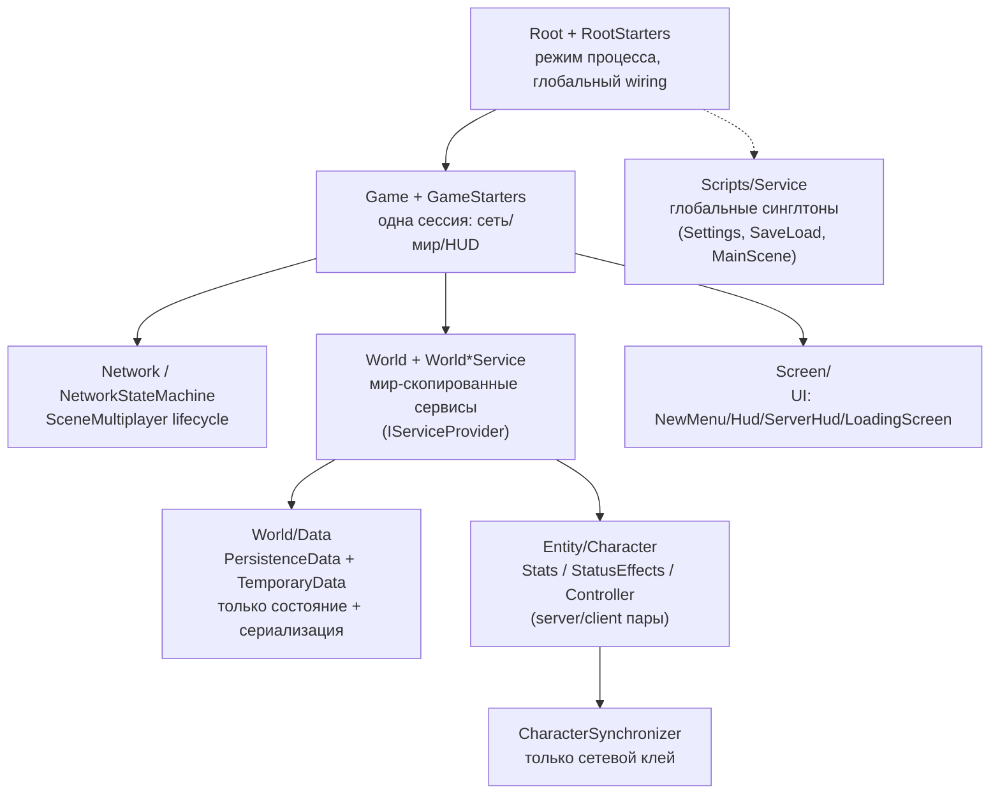

# System architecture

## Стиль

Иерархическое дерево сцен **контейнер → контент** со связкой **сервисный слой + DI**, и **авторитарный сервер** в мультиплеере.

- Дерево сцен строго родитель → ребёнок: родитель знает детей, ребёнок **не** знает родителя.
- Контент пересоздаётся через обёртки `NodeContainer` (`Root.tscn`, `Game.cs`).
- Сквозные сервисы доступны через статическую фасаду `Services` + DI от KludgeBox (`Di.Process(this)`).
- Сам `World` реализует `IServiceProvider`, давая `[SceneService]`-инъекцию мир-скопированных сервисов (`World.cs:29`).
- Сеть — штатный Godot `SceneMultiplayer` + `ENetMultiplayerPeer`, авторитарный сервер (`Network.cs:24-25`).

## Ключевые ограничения

1. **Вызовы идут ВНИЗ по дереву, события/сигналы — ВВЕРХ** (`README.md:144-145`). Единственное исключение — явный `[Parent]`-инжект в двух мир-сервисах.
2. **Клиент и сервер разделяют одно дерево сцен** — роль выбирается в рантайме через `Net.IsServer()`/`IsClient()` (`Character.cs:35-46`).
3. **Один авторитарный путь логики:** singleplayer, host и dedicated-server выполняют «серверную» логику. `Net.IsServer()` = `true` для singleplayer и главного меню (процесс — сам себе авторитет); `false` **только** при подключении как клиент к чужому серверу (`NetworkService.cs:33-42`).

## Слои и границы

| Слой | Владеет | Не владеет |
|------|---------|------------|
| `Root` + RootStarters | выбор режима процесса, разовый глобальный wiring | покадровая игровая логика |
| `Game` + game starters | одна сессия: подъём сети, инстанцирование World/HUD | стат-математика, ИИ |
| `Network` / `NetworkStateMachine` | lifecycle `SceneMultiplayer`, connect/host/shutdown, RPC-коммуникация | игровое состояние |
| `World` (+ `World*Service`) | точки согласованного взаимодействия с системой | внутренности сущностей |
| `World/Data` | состояние + сериализация/синхронизация (нет игровой логики) | правила урона/движения |
| `Entity/Character` подсистемы | поведение персонажа (Stats, StatusEffects, Controller), server/client пары | межсущностная оркестрация |
| `CharacterSynchronizer` | **только сетевой клей** между серверрной и клиентской половинами | любая геймплейная логика |
| `Scripts/Service` | глобальные синглтоны через `Services` | scene-tree-связанная мир-логика |
| `Screen/` | UI-представление | авторитарное состояние |

## Матрица игровых режимов

| Стартер | Сеть | Кто хост | Назначение |
|---|---|---|---|
| `SingleplayerGameStarter` | нет (`Network` не создаётся) | процесс сам себе сервер | одиночная игра из меню, `--auto-start` |
| `HostMultiplayerGameStarter` | ENet-сервер | тот же процесс | хост «изнутри клиента» и dedicated-сервер |
| `ConnectToMultiplayerGameStarter` | ENet-клиент | удалённый процесс | подключение к серверу, `--auto-connect` |
| `HostDedicatedServerAndConnectGameStarter` | ENet-клиент + дочерний процесс | отдельный процесс-сервер | хост с вынесенным сервером (spawn `--server` child, подключение к нему) |

## Известные архитектурные риски

- **`NetworkService.IsServer()` глобальна и side-aware**, а не чистая проверка пира. Singleplayer и главное меню возвращают `true` → любой код, полагающий, что "`IsServer()` ⇒ есть реальный пир", ошибочен. Смягчается задокументированной конвенцией.
- **`SceneMultiplayer` перепривязывается к Game-узлу** при каждом `Network._Ready` — мультиплеерная идентичность привязана к lifetime Game.
- **Hazard порядка shutdown'а** (задокументирован): после `TreeExiting` `GetMultiplayer()` = null; отдельный `WorldServerShutdowner` существует именно потому, что доверять peer'у в этот момент нельзя.
- **Dedicated-сервер как дочерний процесс** (`HostDedicatedServerAndConnectGameStarter`) → IPC-by-PID (`ProcessDeadChecker`/`ProcessShutdowner`), хрупко между ОС.
- **Сильная зависимость от рефлексии** для discovery сервисов, авто-обнаружения чат-команд и генерации настроек.

Подробности: `docs/codebase/ARCHITECTURE.md`, `docs/codebase/CONCERNS.md`.
