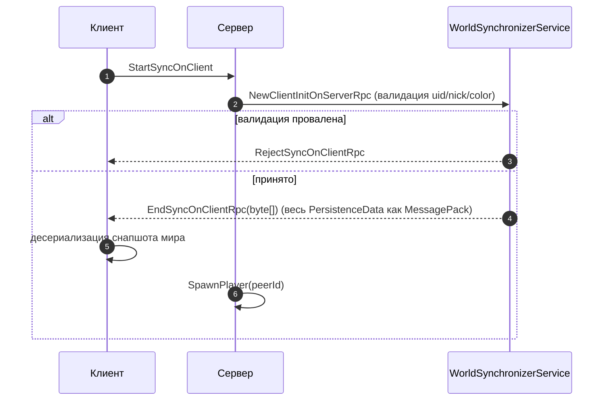

# Key flows

## Поток запуска

```mermaid
sequenceDiagram
    autonumber
    participant G as Godot
    participant R as Root._Ready()
    participant SM as RootStarterManager
    participant S as RootStarter.Init/Start
    participant MS as MainSceneService
    participant Game as Game
    participant W as World
    participant Net as Network

    G->>R: грузит Root.tscn
    R->>R: Di.Process(this); deferred Init()+Start()
    R->>SM: ChooseStarter() (--server ? DedicatedServer : Client)
    SM->>S: выбранного Starter.Init()
    S->>S: exception handler, assembly cache, TypesMapping, LoadingScreen/MainScene/I18N
    S->>Net: Net.Init(isServer)
    S->>S: settings, locale, autoscaling
    SM->>S: Starter.Start()
    S->>MS: MainScene.<mode>(...)
    MS->>Game: создаёт Game + BaseGameStarter
    Game->>Game: starter.Init(game): AddNetwork / AddWorld / AddHud
    alt Сервер
        Game->>W: ServerStartWorld → StartNewGame | LoadGame
    else Клиент
        Game->>W: ClientStartWorld → StartSyncWithServer
    end
    W->>W: _EnterTree(): регистрация Tree, PersistenceData, TemporaryData, World*Services
    Note over W,Net: Пер-кадровый цикл: World-сервисы + Character-подсистемы + Controllers (физика @ 30Гц)
```

(Подтверждено в `Root.cs:16-24`, `RootStarterManager.cs:29-34`, `BaseRootStarter.cs:21-37`, `Game.cs:24-61`, `World.cs:56-80`.)

## Handshake подключения клиента



(`WorldSynchronizerService.cs:64-113`.) Валидируются: uid, ник (длина 3–25, без пробелов), цвет (яркость ≥ 0.2), уникальность подключающегося имени. `MaxSyncPacketSize = 135000` (`Network.cs:10`) ограничивает размер пакета синхронизации.

## Триггеры → путь данных

| Событие | Путь |
|---------|------|
| Запись свойства модели на сервере | `ObservableProperty` → `PropertyChanged` → сторадж подписывается → RPC broadcast дельты. **Присвоение свойства модели на сервере = сетевой трафик.** (`GeneralDataStorage.cs:33-42`) |
| Ввод игрока | `_UnhandledInput` → `CharacterController` → контроллер на сервере → `Controller_SendMovement` (per-unit, unreliable) → клиентский `RemoteController` интерполирует/экстраполирует (`CharacterSynchronizer_Controller.cs:69-75`) |
| Физика | `_PhysicsProcess` @ 30Гц → stats-реген, статус-эффект-тики, `CharacterController.OnPhysicsProcess/OnIntegrateForces` (`Character.cs:52-70`, `PhysicsCalculator.cs`) |
| Чат-команда | клиент → `WorldChatService.Save()` → `SaveRpc` (public wrapper + private `*Rpc` receiver) → `/cmd` перехватывается `ChatMessageCommandInterceptor` → автодискавери `ICommandProcessor` (`WorldChatService.cs:27-50`) |
| Сохранение | сервер → `WorldDataSaveLoadService` → MessagePack в `user://saves/<name>.bin`; авто-сейв через `WorldServerShutdowner` при выходе |

## Shutdown

`WorldServerShutdowner` ловит `NotificationExitTree` → авто-сейв → `Network.Shutdown()` (также на `NotificationExitTree`) → сносит peer; `MainSceneService.Shutdown()` → deferred `Quit()`.

> **Hazard порядка shutdown'а:** после `TreeExiting` `GetMultiplayer()` = null и `Network` мог подменить peer на `OfflineMultiplayerPeer`. Именно поэтому существует отдельный `WorldServerShutdowner` — в `_exit_tree`-смежном коде доверять `GetMultiplayer()`/`Network` нельзя. См. [[network-shutdown-ordering-hazard]].

Подробнее: `docs/codebase/ARCHITECTURE.md` §2, §System Flow.
