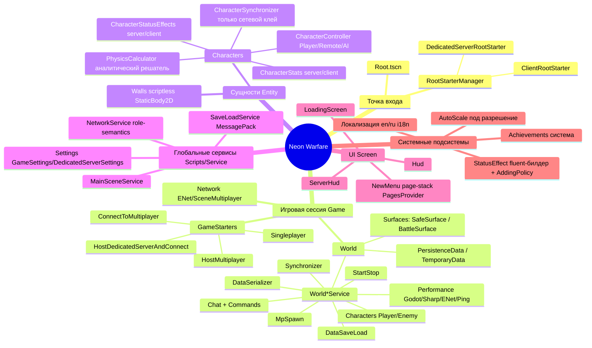

# Feature mindmap

## Ветки признаков из макета

| Ветка | Назначение |
|-------|------------|
| Entry | выбор режима процесса (client/dedicated-server) |
| Game session | один матч: подъём сети, инстанцирование World, режим старта |
| World | мир-контейнер: поверхности, данные, мир-сервисы |
| Entity | игровые объекты; персонажи разделены на server/client пары |
| Global services | сквозные синглтоны через `Services` |
| UI | presentation-слой (без авторитарного состояния) |

> **Текущее состояние (см. background):** часть систем заложена, но не подключена — `NavigationService`/`Pathfinder` написаны, но не используются; `BattleSurface` пуст; `ClientPackedScenes` пуст; скиллы/атаки не реализованы (только заглушки ввода).
