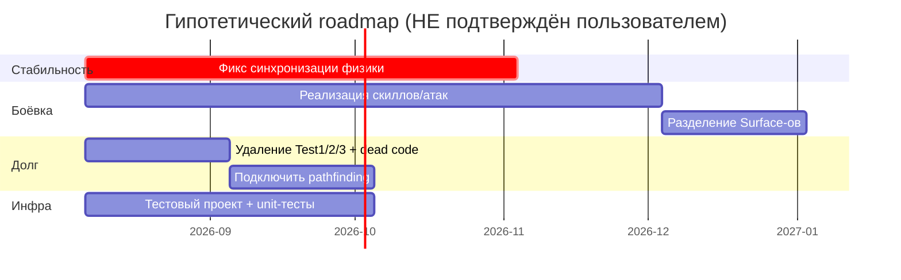

# Roadmap

> ⚠️ **Уверенность низкая — нужна подтверждение.** Явный roadmap/дорожная карта в репозитории **отсутствует**. То, что ниже, выведено из `//TODO`, раздела README «Текущее состояние» и `docs/codebase/CONCERNS.md` — это наблюдаемое направление, а не задокументированный план пользователя. Не принимать как обязательство.

## Выводимые векторы работы

| Вектор | Состояние | Сигнал |
|--------|-----------|--------|
| **Подключить заложенные, но неиспользуемые системы** | заложено, не активировано | `NavigationService`/`Pathfinder` написаны, но не в мире; `ClientPackedScenes` пуст; `BattleSurface` пуст | 
| **Реализовать боевую механику** | заглушки | скиллы/атаки не реализованы (только `CharacterStat` + stub-обработка ввода) |
| **Разделить `SafeSurface` / `BattleSurface`** | не различаются | см. background §открытые вопросы |
| **Стабилизировать синхронизацию клиент/сервер-физики** | активно нестабильно | множество TODO в `PhysicsCalculator.cs`; documented-дефекты (прохождение сквозь врагов на скорости, spawn-телепорт во (0;0), нелинейный рост server-TPS) — см. [[client-server-physics-sync-defects]] |
| **Решить design-TODO `CharacterController`** | открытый вопрос | оставить единым с флагами или разбить на server/client + Facade |

## Известный технический долг (из CONCERNS.md)

- `Test1/2/3` debug-кнопки + `World.Test1/2/3` RPC в production-коде (`Hud.cs:42`, `World.cs:98-144`).
- Dead code: `NavigationService` + `Pathfinder`, пустой `ClientPackedScenes`, legacy `ContextStorage`.
- 5 файлов `*.csproj.old*` в корне — ручные бэкапы, шум.
- `PhysicsCalculator`-тюнинг захардкожен (`_force=5000`, `GroundFriction=2000`, `MaxSpeed=1000`), `MaxSpeed`-кламп закомментирован.
- Дублирование логики клампа между `CharacterStats` и `CharacterStatsClient`.
- Бинарные `.psd` (до 8.6 MB) закоммичены — стоит вынести из репо.

## Предварительный набросок (гипотеза — подтвердить)

## Открытые вопросы

- **Каков реальный план и приоритеты?** (Вышеперечисленное — вывод, а не заданный план.)
- **Ближайшая веха** — что должно быть готово следующим?
